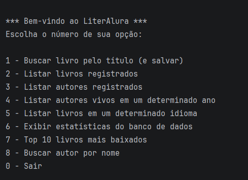
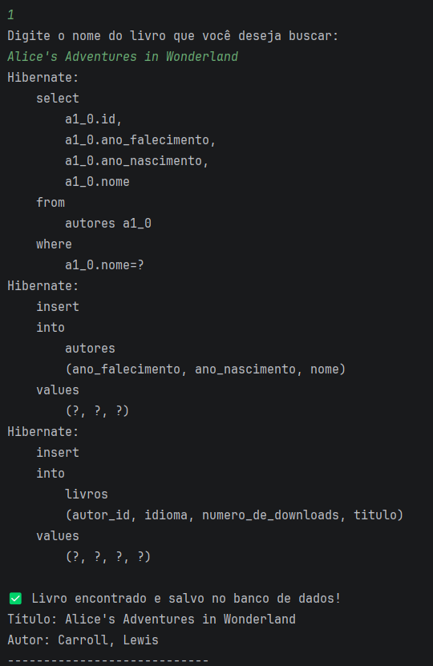
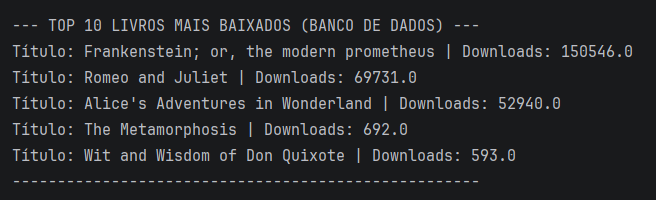

# 📚 LiterAlura - Catálogo de Livros



## 📌 Sobre o projeto
Este projeto foi desenvolvido por **Endrik de Oliveira Alves** como parte do programa **ONE - Oracle Next Education** em parceria com a **Alura**.  
O objetivo do desafio *LiterAlura* é construir um catálogo de livros interativo via console, colocando em prática o consumo de APIs externas, manipulação e desserialização de JSON, e persistência de dados em um banco de dados relacional utilizando o ecossistema Spring.

## 🚀 Funcionalidades
- Menu interativo via console para navegação do usuário.
- Consumo da **Gutendex API** para buscar informações reais de livros pelo título.
- Persistência automática de livros e autores no banco de dados.
- Tratamento para evitar duplicidade de livros salvos.
- Listagem completa de livros e autores já registrados.
- Filtro para listar autores que estavam vivos em um determinado ano.
- Listagem de livros por idioma, exibindo a quantidade total encontrada.
- **✨ Recursos Extras Implementados:**
    - Geração de estatísticas de downloads (média, máximo, mínimo e total).
    - Ranking com o Top 10 livros mais baixados do banco de dados.
    - Busca de autores cadastrados por trecho do nome.
- Tratamento de exceções para entradas inválidas (ex: digitar letras em vez de números).

## 🛠️ Tecnologias utilizadas
- Java (JDK)
- Spring Boot
- Spring Data JPA (Hibernate)
- PostgreSQL (Banco de Dados Relacional)
- Biblioteca **Jackson** (`com.fasterxml.jackson`) para mapeamento de JSON
- `java.net.http.HttpClient` para requisições HTTP
- Maven
- IntelliJ IDEA

## 📷 Demonstração

### Menu de Opções:


### Exemplo de Busca e Salvamento no Banco:


### Exemplo de Filtros e Estatísticas Extras:


## 📂 Como executar o projeto localmente

1. **Clone este repositório:**
```bash
git clone [https://github.com/endrik289/Challenger-LiterAlura-OracleNextEducation.git](https://github.com/endrik289/Challenger-LiterAlura-OracleNextEducation.git)
```

2. **Configure o Banco de Dados:**
- Certifique-se de ter o PostgreSQL instalado e rodando.
- Crie um banco de dados vazio chamado `literalura`.
- Abra o arquivo `src/main/resources/application.properties` e atualize as credenciais (`username` e `password`) com as do seu banco local.

3. **Execute a aplicação:**
- Abra o projeto na sua IDE (recomendado IntelliJ IDEA).
- O Maven irá baixar as dependências automaticamente.
- Rode a classe principal `LiteraluraApplication.java`.
- Interaja com o menu pelo console da IDE!